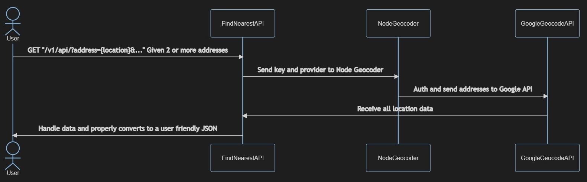

# Calindra's Backend Challenge
The challenge is to create a API Rest that receives 2+ addresses and calculates the euclidean distance between them all and return nearest to the farthest

---  

## Setup 
Create a .env file containing your Google API key
```
echo API_KEY="YOUR API KEY" > .env
```
Install all dependencies
```
npm install
```

## Running
Start the application
```
ts-node src/index.ts
```

## Testing
Check if the application is working properly
```
npx jest
```

## Usage
curl 
```
curl --location --request GET "http://localhost:8000/v1/api/?address=Av.%20Rio%20Branco,%201%20Centro,%20Rio%20de%20Janeiro%20RJ,20090003&address=%20Pra%C3%A7a%20Mal.%20%C3%82ncora,%20122%20Centro,%20Rio%20de%20Janeiro%20RJ,%2020021200&address=Rua%2019%20deFevereiro,%2034%20Botafogo,%20Rio%20de%20Janeiro%20RJ,%2022280030"
```  

or  
  

browser
- Base URL = "http://localhost:8000/v1/api/?"  
- query params = address  


```
http://localhost:8000/v1/api/?address=rio de janeiro&address=sao paulo&address=minas gerais
```

---

# Find Nearest API Diagram



