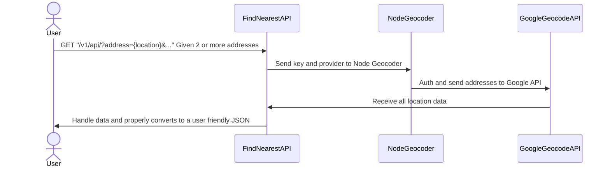

# Calindra's Backend Challenge
The challenge is to create a API Rest that receives 2+ addresses and calculates the euclidean distance between them all and return nearest to the farthest

# Running
using Curl 
```
curl --location --request GET "http://localhost:8000/v1/api/?address=Av.%20Rio%20Branco,%201%20Centro,%20Rio%20de%20Janeiro%20RJ,20090003&address=%20Pra%C3%A7a%20Mal.%20%C3%82ncora,%20122%20Centro,%20Rio%20de%20Janeiro%20RJ,%2020021200&address=Rua%2019%20deFevereiro,%2034%20Botafogo,%20Rio%20de%20Janeiro%20RJ,%2022280030"
```

# Find Nearest API Diagram


