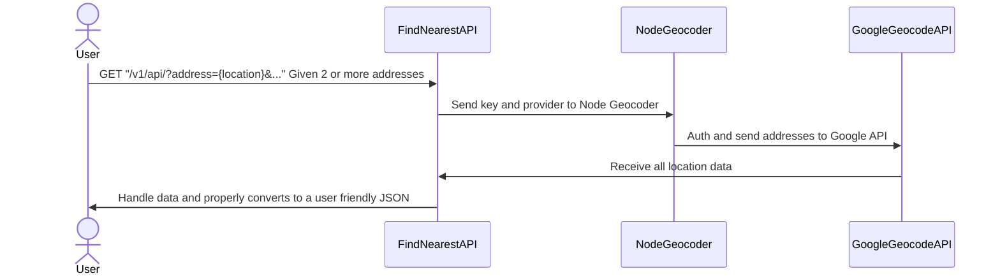

# Find Nearest API Diagram

```mermaid
sequenceDiagram;
    Actor User
    participant FindNearestAPI
    participant NodeGeocoder
    participant GoogleGeocodeAPI

    User->>FindNearestAPI: GET "/v1/api/?address={location}&..." Given 2 or more addresses
    FindNearestAPI->>NodeGeocoder: Send key and provider to Node Geocoder
    NodeGeocoder->>GoogleGeocodeAPI: Auth and send addresses to Google API
    GoogleGeocodeAPI->>FindNearestAPI: Receive all location data
    FindNearestAPI->>User: Handle data and properly converts to a user friendly JSON
```